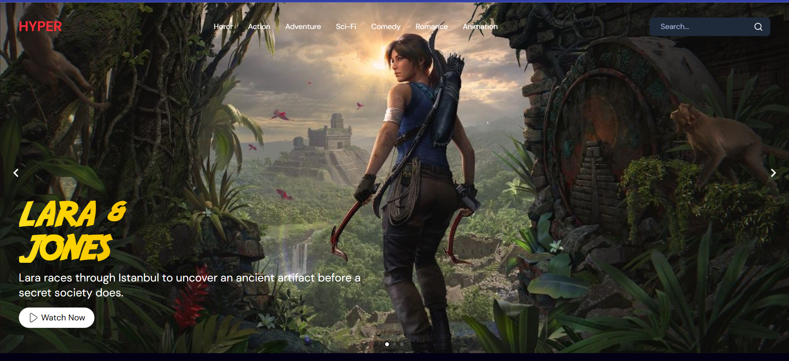

# Movie Website using React + Vite
This project is still in progress. I built this movie website to refresh my knowledge of ReactJS after some time away :))

## Table of contents

- [Overview](#overview)
  - [The challenge](#the-challenge)
  - [Screenshot](#screenshot)
  - [Links](#links)
  - [Credit](#credit)
- [My process](#my-process)
  - [Built with](#built-with)
  - [What I learned](#what-i-learned)
  - [Continued development](#continued-development)
  - [Useful resources](#useful-resources)
- [Acknowledgments](#acknowledgments)
- [Author](#author)
- [Getting Started](#getting-started)


## 🚨 Overview

### The challenge

- Build out the project to the designs provided
- Implementing search functionality 
- Connecting to Appwrite as back end database 

### Screenshot


### Links
The live site is deployed in vercel
- [Live Site URL](https://movie-website-using-react-js-19.vercel.app/)

### Credit
[Framer Web Design i used for this project is design by Faruk Yurtseven](https://framer.com/projects/HypeR-copy--ff5PH7sBjpAsOaSZcWqM-biFD6?duplicate=BkVLjcw3vgR8LFEg8UEK&node=PZQyOnG_6&item=i_9zvVwtX)

## ⚙️ My process

### Built with

- Semantic HTML5 markup
- CSS custom properties
- Flexbox
- CSS Grid
- [React JS](https://react.dev/) - React Framework for Production
- [Appwrite](https://appwrite.io/) - For database
- [lucide-react](https://lucide.dev/guide/packages/lucide-react) - react library that to add icons (menu, search, X)
- [react-icons](https://www.npmjs.com/package/react-icons) - react library that to add icons (play icon)
- [swiper react](https://swiperjs.com/react) - JS library to add slider component
- [API movies](https://developer.themoviedb.org/reference/discover-movie) - Movie API from TMDB

### What I learned
To be continued..

### Continued development
To be continued..

### Useful resources
- [UI/UX Design Resources from Framer]([https://ui8.net/](https://framer.com/projects/HypeR-copy--ff5PH7sBjpAsOaSZcWqM-biFD6?duplicate=BkVLjcw3vgR8LFEg8UEK&node=augiA20Il))
- [Tutorial React JS 19 Movie Application by JavaScript Mastery](https://www.youtube.com/watch?v=dCLhUialKPQ) 

## Acknowledgments

A HUGE Thanks to Javascript Mastery youtube channel which really helps me in learning about web development. I recommend this channel to everyone who wants to learn about web development and javascript

## Author
Github - [Shabrina Putri](https://github.com/shabrina12)

## 🤸 Getting Started

To run the development server:

```bash
npm run dev
```
